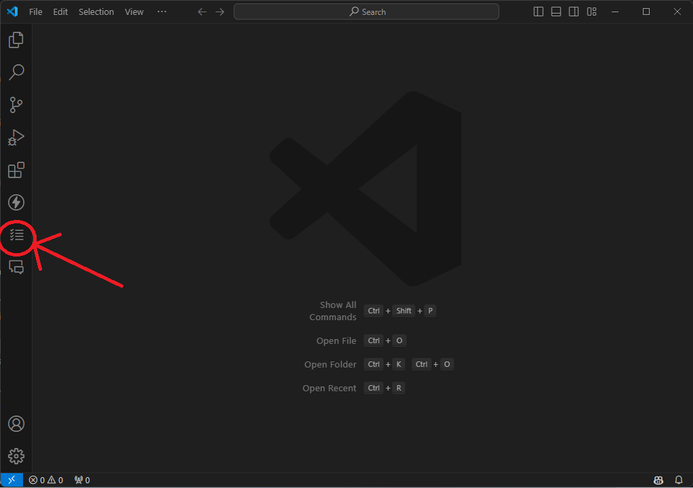
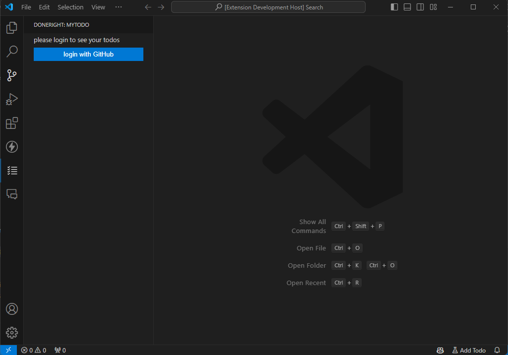
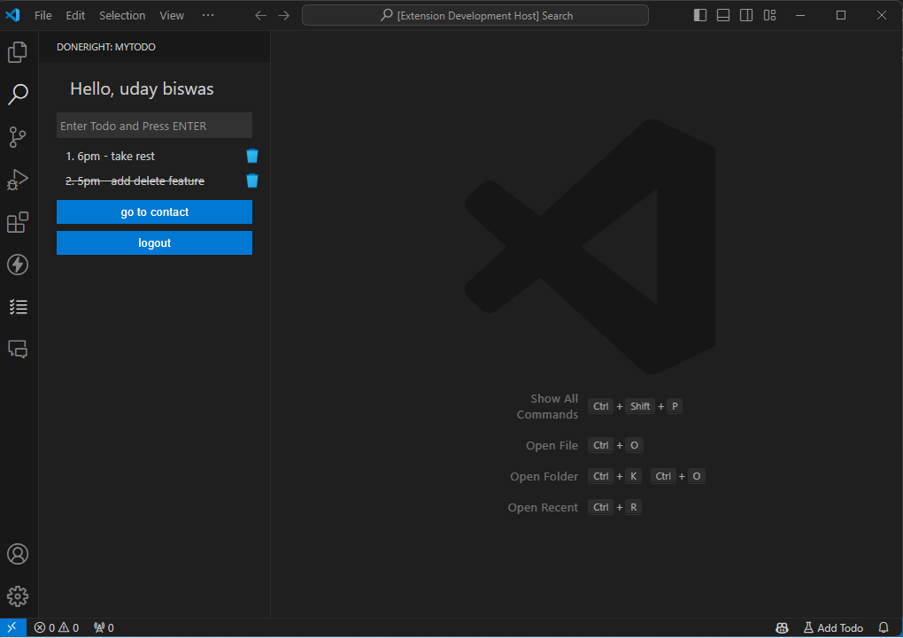
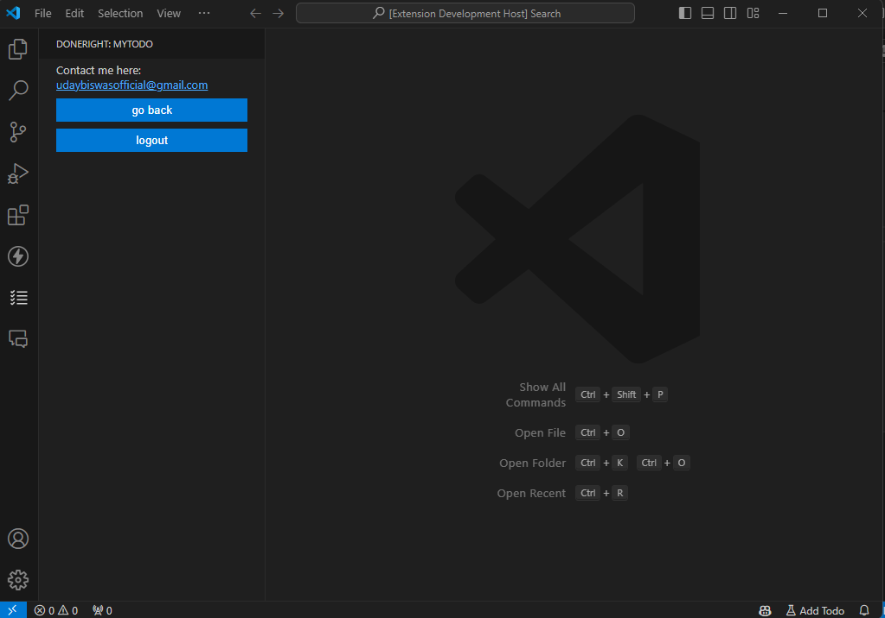

# DoneRight - Todo Extension for VS Code

Welcome to **DoneRight**, a powerful and intuitive Todo extension for Visual Studio Code. Organize your tasks, track progress, and boost productivity right within your code editor!

## Usage

1. After installation, open the sidebar and click on **DoneRight**.

2. Click **Login with GitHub** to authenticate.

3. Manage your tasks in the **Todos** section.

4. Switch to the **Contact** section for additional info.

## Features

- **Easy Task Management**: Create, edit, and delete tasks with ease.
- **Task Completion**: Mark tasks as complete or incomplete.
- **User Authentication**: Securely log in with GitHub to manage your tasks.
- **Responsive Design**: Seamlessly switch between Todos and Contacts view.

## Installation

1. Open Visual Studio Code.
2. Go to the Extensions view by clicking the Extensions icon in the Activity Bar on the side of the window.
3. Search for `DoneRight`.
4. Click **Install**.

## Author

👤 Uday Biswas
- Github: [@UdayBiswas](https://github.com/uday-biswas) 
- Linkedin: [@UdayBiswas](https://www.linkedin.com/in/udaybiswas944/)  

## Show your support

Give a ⭐️⭐️⭐️⭐️⭐️ if you like this extension !!